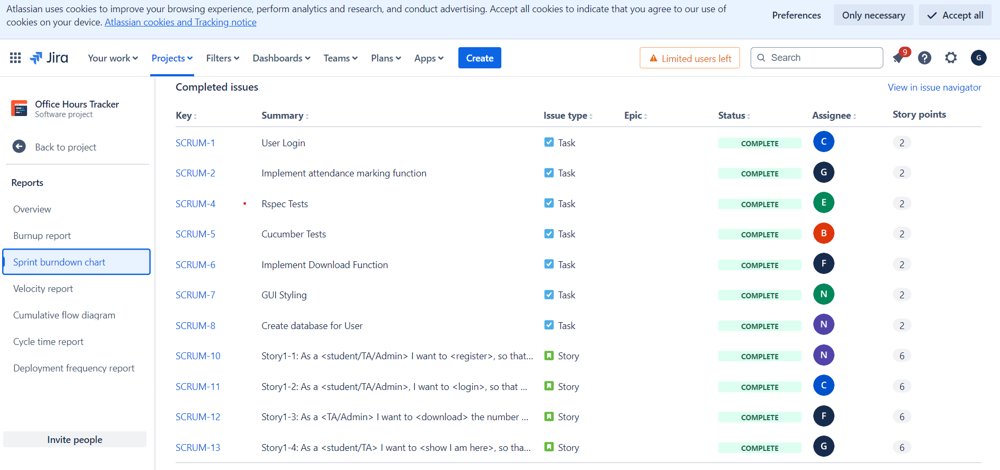

# Office Hours Tracker

- [Deployed Application](https://office-hours-tracker-a63f1f6d64ad.herokuapp.com/)

- [Code Climate Report](https://codeclimate.com/github/gourangi0309/CSCE_606_Office_Hours_Tracker)

# Goal

- The app will allow students to mark their attendance. TAs can clock their shifts in the web application and mark their attendance. Admin can view Excel reports for payroll and analytics. Users can switch between student and admin roles depending on their class.

# Sprint 1

- [Sprint Burndown Chart](https://tamu-team-office-tracker.atlassian.net/jira/software/projects/SCRUM/boards/1/reports/burndown?source=sidebar)
- [Burnup Report](https://tamu-team-office-tracker.atlassian.net/jira/software/projects/SCRUM/boards/1/reports/burnup)
